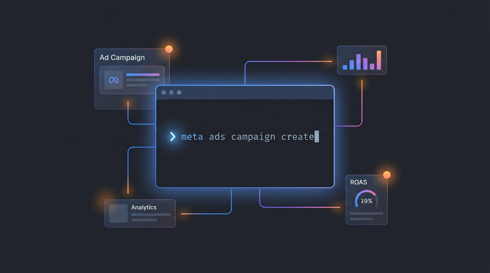

# Meta Ads CLI — Agent Skill



An [agent skill](https://github.com/vercel-labs/skills) that teaches your AI coding agent to operate the **Meta (Facebook/Instagram) Ads CLI** — the `meta` command from the [`meta-ads`](https://pypi.org/project/meta-ads/) Python package — end to end from the terminal.

Manage the full ad stack without leaving the chat: campaigns, ad sets, ads, creatives, pixels/datasets, product catalogs/feeds/sets, ad accounts, and Pages — plus pull insights (spend, ROAS, CTR, CPC, conversions).

## Install

Install into any agent that supports skills (Claude Code, Cursor, etc.) with one command:

```bash
npx skills add gfsaaser24/meta-ads-cli
```

To preview before installing, or target a specific agent:

```bash
npx skills add gfsaaser24/meta-ads-cli --list      # see what's in the repo
npx skills add gfsaaser24/meta-ads-cli -a claude   # install to Claude Code only
```

The CLI copies the skill into your tool's expected location (e.g. `.claude/skills/meta-ads-cli/`).

## What it does

Once installed, the agent activates the skill whenever you ask it to work with Meta ads from the command line. It follows a **install → authenticate → run** workflow:

1. **Install** — provisions Python 3.12+ via `uv` and installs the `meta` CLI in isolation (idempotent setup script included).
2. **Authenticate** — uses a Meta system-user access token + ad account ID via a project `.env` (no interactive login).
3. **Run** — noun-verb commands like `meta ads campaign list` or `meta ads insights get --date-preset last_7d --fields spend,impressions,ctr,cpc`.

### Built-in guardrails

The skill teaches the agent the gotchas that cost real money:

- **Budgets are in cents** — `--daily-budget 5000` means $50.00.
- **New objects are created `PAUSED`** — nothing spends until explicitly set `ACTIVE`.
- **Deletes cascade** — deleting a campaign removes its ad sets and ads.
- **Meaningful exit codes** for scripting (auth vs. API vs. usage errors).

## What's inside

```
skills/meta-ads-cli/
├── SKILL.md                          # main instructions (install → auth → run)
├── references/
│   ├── commands.md                   # every resource & action, flags, enums, exit codes
│   ├── creatives-catalogs.md         # ad creatives + catalog/dataset workflows
│   ├── insights.md                   # insights: date presets, breakdowns, metrics
│   └── setup-and-auth.md             # generating the system-user token & scopes
└── scripts/
    └── setup_meta_cli.sh             # idempotent CLI installer
```

## Requirements

- An AI agent that supports the open skills format
- A Meta system-user access token with Ads Management scopes and an ad account ID
- Python 3.12+ available (the setup script provisions it via `uv` when missing)

## License

MIT
